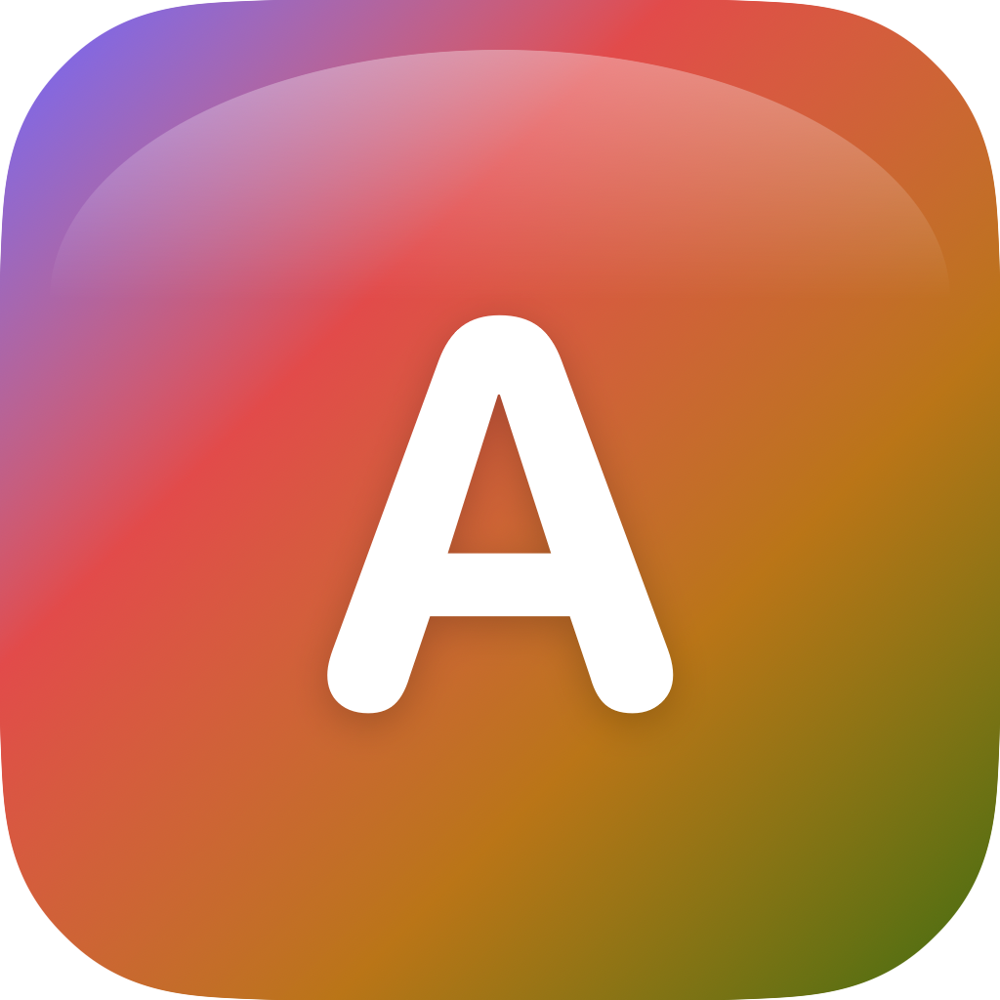
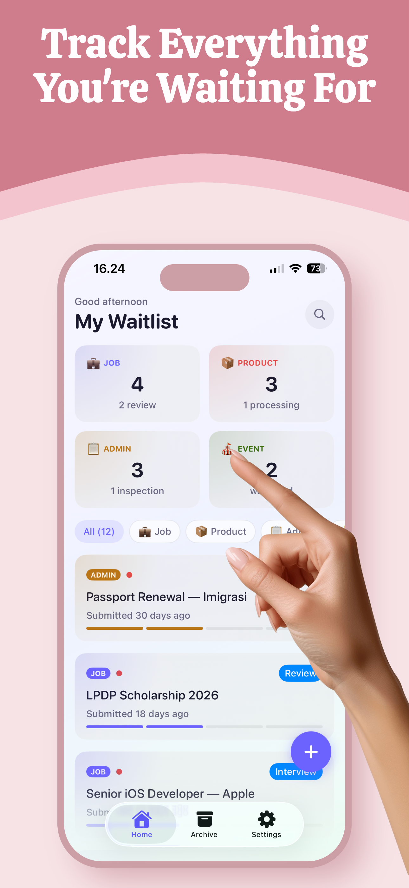
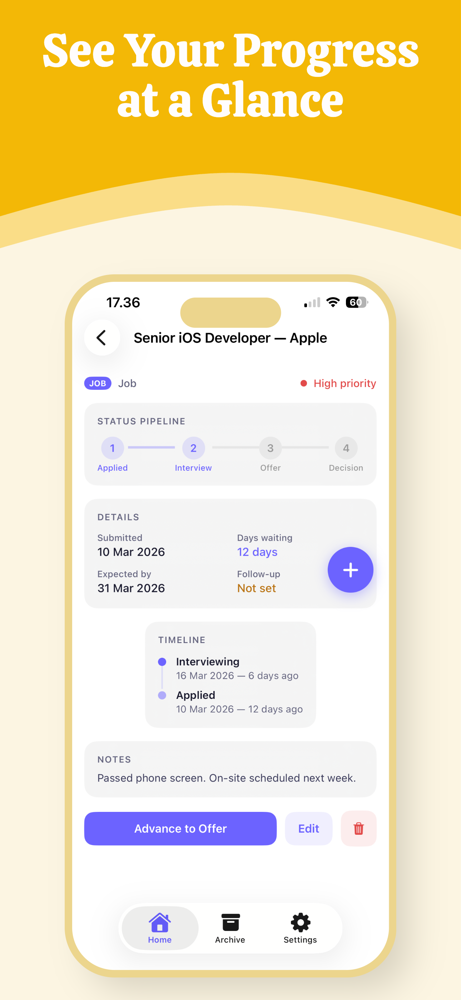
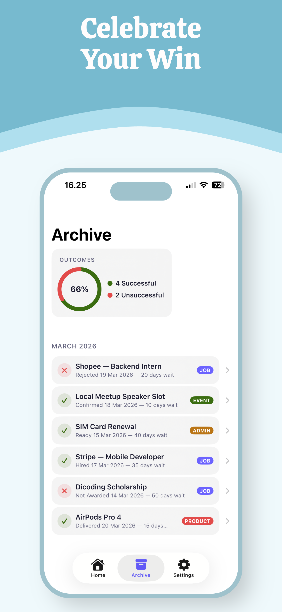
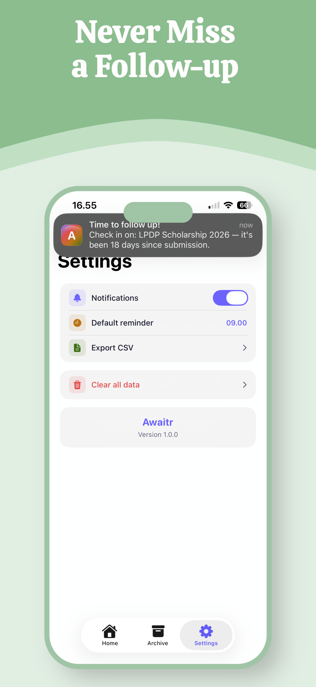

<p align="center">
  
</p>

<h1 align="center">Awaitr</h1>

<p align="center">
  <strong>Personal waitlist manager for iOS</strong><br>
  Track jobs, scholarships, pre-orders, permits, and events — all in one place.
</p>

<p align="center">
  <a href="https://apps.apple.com/app/awaitr/id6760962108">
    
  </a>
</p>

<p align="center">
  
  
  
  
  
</p>

---

## What is Awaitr?

Awaitr gives you a single place to track everything you're waiting for. Every item flows through a visual pipeline so you always know exactly where things stand.

**The problem:** You apply for a job, submit a scholarship, pre-order a product... then spend weeks checking your email. Everything is scattered across notes, spreadsheets, and your memory.

**The solution:** One app with a clear pipeline view — Submitted, In Review, Awaiting, Accepted/Rejected — for all your waitlists.

## Features

- **Visual Pipeline Tracking** — See the status of every item at a glance with category-specific stages
- **Smart Reminders** — Set follow-up dates and get notified when it's time to check in
- **4 Categories** — Jobs, Products, Admin, Events — each with tailored pipeline templates
- **Archive & Analytics** — Track your outcomes and success rate over time
- **CSV Export** — Export your data anytime
- **Priority Levels** — High, Medium, Low with color coding
- **100% Offline** — All data stored on-device with SwiftData. No accounts, no cloud, no tracking
- **Liquid Glass UI** — Built from scratch for iOS 26 with Apple's latest design language

## Screenshots

<p align="center">
  
  
  
  
</p>

## Tech Stack

| | |
|---|---|
| **Language** | Swift 6.2 |
| **UI** | SwiftUI with iOS 26 Liquid Glass |
| **Data** | SwiftData (on-device) |
| **Architecture** | MVVM with @Observable ViewModels |
| **Notifications** | UserNotifications |
| **Dependencies** | Zero — pure Apple frameworks |
| **Min. Deployment** | iOS 26 |

## Project Structure

```
Awaitr/
├── AwaitrApp.swift            # App entry point
├── ContentView.swift          # TabView navigation
├── Models/                    # WaitItem (@Model), enums, StatusEntry
├── ViewModels/                # @Observable VMs per screen
├── Views/
│   ├── Home/                  # Dashboard, WaitItemCard, SummaryStats
│   ├── Detail/                # ItemDetail, PipelineProgress, Timeline
│   ├── AddEdit/               # AddEditItem, CategoryPicker
│   ├── Archive/               # ArchiveView, ArchiveStats
│   ├── Settings/              # SettingsView
│   ├── Onboarding/            # 4-screen interactive onboarding
│   └── Components/            # GlassCard, StatusBadge, PriorityDot, FAB
├── Extensions/                # Color+Category, Date+Relative, Theme
├── Services/                  # NotificationService, ExportService
└── Resources/                 # Assets, Preview Content
```

## Building

Awaitr requires **Xcode 26** (beta) with the iOS 26 SDK.

```bash
# Clone the repo
git clone https://github.com/FiqhroDeden/Awaitr.git

# Open in Xcode
open Awaitr.xcodeproj

# Select scheme: Awaitr > iPhone 16 Pro simulator
# Build and run: Cmd+R
```

> **Note:** Liquid Glass effects only render in the simulator, not in SwiftUI canvas previews.

## Architecture

- Every screen has its own `@Observable` ViewModel
- Views never access `ModelContext` directly — mutations go through ViewModels
- Business logic lives in ViewModels and Services, never in View bodies
- `StatusEntry` is a `Codable` struct stored as JSON in `WaitItem` (not a separate model)
- Navigation uses `NavigationStack` with typed `NavigationPath`

## Roadmap

- [ ] Home Screen Widget (WidgetKit)
- [ ] iPad support
- [ ] iCloud Sync
- [ ] Siri Shortcuts
- [ ] Apple Watch companion
- [ ] Localization (Bahasa Indonesia first)

## Privacy

Awaitr collects **zero data**. No accounts, no analytics, no tracking, no servers. All data is stored locally on your device using Apple's SwiftData framework. See the [Privacy Policy](https://awaitr.vercel.app/privacy).

## Links

- [App Store](https://apps.apple.com/app/awaitr/id6760962108)
- [Landing Page](https://awaitr.vercel.app)
- [Twitter/X](https://x.com/fiqhrodedhen)
- [Threads](https://threads.net/@fiqhrodedhen)

## License

MIT License. See [LICENSE](LICENSE) for details.
